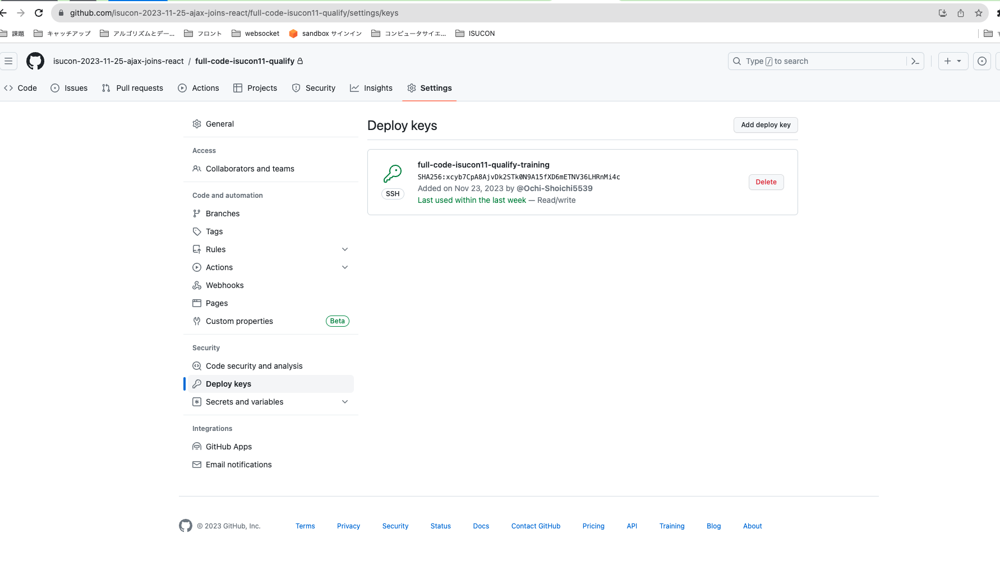

# リモートサーバーからpushする
## 1. Githubリポジトリを作成する
**privateリポジトリにするようにしましょう。**
## 2. リモートサーバーの公開鍵を、リポジトリにdeploy keyとして追加する
まず、リモートサーバー上でキーペアを作成します。
（rootユーザーに変更しないと、home/isucon/以下に作成されるので注意。）
```bash
# rootユーザーに変更する
$ sudo su root
# キーペアを作成する
$ ssh-keygen -t rsa
```

作成したid_rsa.pubな中身をdeploy_keyとして登録します。



## 3. git pushする
以下のような流れでコマンドを実行する
```bash
# READMEを準備する
$ sudo touch README.md
$ sudo vim README.md

# ローカルリポジトリの作成・add/commit
$ sudo git init
$ sudo git add README.md
$ sudo git commit -m "first commit"

# configを登録する
$ sudo git config --global user.email dekamintv@gmail.com
$ sudo git config --global user.name Ochi-Shoichi5539

# pushする
$ sudo git branch -M main
$ sudo git remote add origin git@github.com:isucon-2023-11-25-ajax-joins-react/full-code-isucon11-qualify.git
$ sudo git push -u origin main
```

## 参考
- https://qiita.com/tamorieeeen/items/c24f8285448b607b12dd
